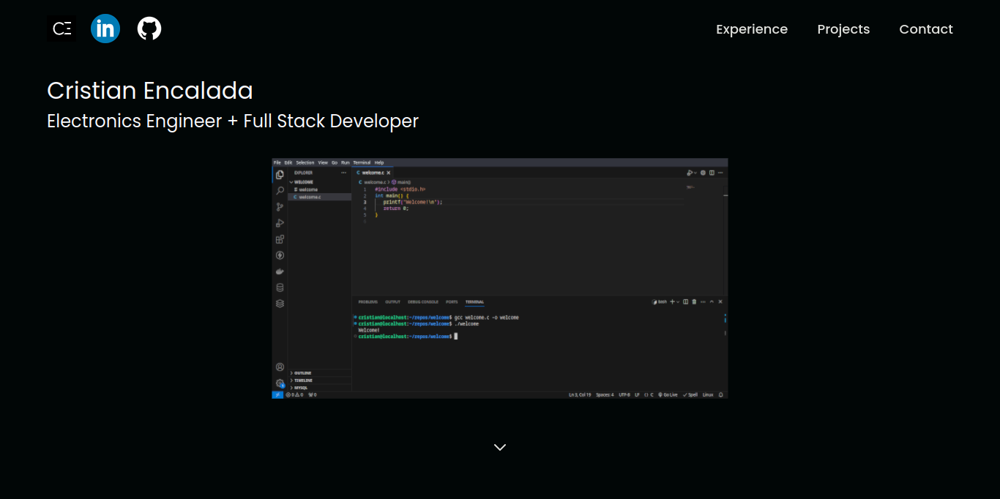

# Personal Porftfolio

Project built with Vite, React, JavasScript, Tailwindcss, Three.js, React-three-fiber.

## Main page


  
## Demo

[](https://cristian-encalada.vercel.app/)

## Run Project 

1. Install dependencies:
```bash 
  npm install
```


2. Run this project

```bash 
  npm run dev
```
    
## Contributing

Contributions are always welcome!

Fork this repo, make changes, test, create a pull request.

Please make sure to maintain `authorship`.

  
## Credits

- [@adrianhajdin](https://github.com/adrianhajdin/project_3D_developer_portfolio) - Main design idea
- [@nabendu82](https://github.com/nabendu82/image-transition-r3f) - Image transition react-three-fiber
- [@zcreativelabs](https://github.com/zcreativelabs/react-simple-maps) - React SVG map
- [@max37](https://www.npmjs.com/package/react-type-animation) - React type animation

## License

[MIT](./LICENSE)

[](./LICENSE)

  