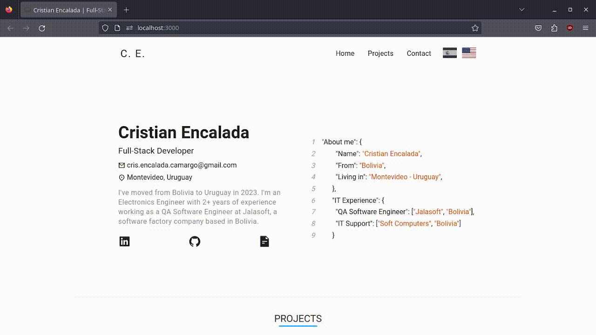

# Portfolio




Portfolio created with Next.js, stylized by using styled-components and internationalization with next-i18next. Support for English and Spanish languages.

<hr />


## Live Demo

[](https://cristian-encalada.vercel.app/)

## Run the project

### Pre-requisites

Install yarn via npm:

```sh
npm install --global yarn
```

For other alternatives, check the [Yarn official documentation](https://classic.yarnpkg.com/en/docs/install#debian-stable)

###

1.  Install the project dependencies by running the following command:

```sh
yarn
```

2.  Start the project by the following command:

```sh
yarn dev
```

## Contributing

Contributions are always welcome!

Fork this repo, make changes, test, create a pull request.
  
## Credits

- [@luanpanno](https://github.com/luanpanno/portfolio) - Original idea

## License

[](./LICENSE)